# 🏈 SportsData NFL API Dashboard & Intelligence Suite

An enterprise-grade, real-time NFL analytics, live scoreboard, and database visualization suite built with React 19, TypeScript, Tailwind CSS, Express, and Vite. Designed to explore, simulate, query, and inspect raw SportsData.io NFL APIs, ESPN live game scoreboards, sports betting odds, DFS fantasy metrics, injury trackers, and local Ollama / Gemini AI sports analytics.

---

## 📑 Table of Contents

1. [Description & Overview](#-description--overview)
2. [Key Capabilities & Modules](#-key-capabilities--modules)
3. [System Architecture Diagram](#-system-architecture-diagram)
4. [User Workflow](#-user-workflow)
5. [Codeflow & Runtime Lifecycle](#-codeflow--runtime-lifecycle)
6. [Database Schema & Collections Catalog](#-database-schema--collections-catalog)
7. [API Reference & Endpoints](#-api-reference--endpoints)
8. [Automated Bootstrap (`bootstrap.sh`) & Setup](#-automated-bootstrap-bootstrapsh--setup)
9. [Configuration & Environment Variables](#-configuration--environment-variables)
10. [Build & Deployment](#-build--deployment)

---

## 📖 Description & Overview

The **SportsData NFL API Dashboard** serves as a complete command center for NFL data exploration, real-time game simulation, sportsbook analysis, and developer API diagnostics. It interfaces with live ESPN feeds, SportsData.io v3 endpoints, an in-memory SQL sandbox, and dual AI engines (Local Ollama LLM + Google Gemini 2.5 Flash).

### 🛠️ Technology Stack

| Layer | Technologies |
| :--- | :--- |
| **Frontend Framework** | React 19, TypeScript, Vite 6 |
| **Styling & Design System** | Tailwind CSS v4, Dark Slate / Amber Accent Palette, Modern Micro-interactions |
| **Data Visualization** | Recharts (Area, Bar, Composed charts), Lucide React Icons |
| **Animations & Motion** | Motion (`motion/react`) |
| **Backend & Middleware** | Node.js, Express 4, Vite Dev Server Middleware, `tsx`, `esbuild` |
| **AI & LLM Services** | Local Ollama (`llama3`, `mistral`, `deepseek-r1`) + Google GenAI SDK (`gemini-2.5-flash`) |
| **Data Providers** | ESPN Live Scoreboard API, SportsData.io v3 NFL API, In-Memory Structured Mock Datasets |

---

## ⚡ Key Capabilities & Modules

The application features **11 specialized visualization views** plus developer tools:

1. **Standings & Division Matrix**: AFC & NFC conference hierarchies, division leaders, win-loss-tie records, point differentials, home/away splits, and playoff seedings.
2. **Scoreboard & Live Game Simulator**: Live ESPN scoreboard integration with a custom clock engine, possession trackers, down-and-distance indicators, and quarter-by-quarter drive progression.
3. **Team Rosters & Stadium Profiles**: Comprehensive directory of all 32 NFL franchises, head coaches, stadium turf types, capacities, coordinates, and offensive/defensive schemes.
4. **Player Leaderboards & Advanced Stats**: Passing, rushing, receiving, and defensive player metrics with sorting, search, and statistical comparison.
5. **Game Schedules & Venues**: 2026/2025/2024 regular season, preseason, and postseason game schedules with broadcast networks, weather conditions, and venue details.
6. **Play-by-Play & Drive Probability**: Real-time play timeline, down & distance tracker, and visual win probability curves powered by Recharts.
7. **Depth Charts & Injury Availability Matrix**: 3-tier positional depth charts (offense, defense, special teams) combined with official practice participation and injury status classifications.
8. **Live Betting Lines & Odds Shift**: Consensus spreads, moneylines, over/under totals, and line movement tracking across major sportsbooks (DraftKings, FanDuel, BetMGM).
9. **Fantasy Projections & DFS Value Matrix**: Daily Fantasy Sports (DFS) salary valuations, baseline/ceiling projected points, ownership percentages, and value multiplier formulas.
10. **RotoBaller News & Transaction Wire**: Real-time breaking headlines, injury updates, waiver claims, trades, and roster transactions.
11. **Live Database Core & SQL Sandbox**: In-memory multi-table database inspector with column filtering, pagination, JSON/CSV exports, and an interactive SQL query sandbox (`SELECT`, `WHERE`, `ORDER BY`, `LIKE`).
12. **Developer API Inspector**: Live endpoint tester and documentation console for SportsData.io routes with real-time response latency metrics and JSON copy utilities.
13. **Local Ollama & Gemini Sports Analyst**: AI-powered conversational assistant that analyzes active dashboard data contexts to generate strategic summaries and betting breakdowns.
14. **Customizable Drag-and-Drop Workspace Grid**:
    - **Direct Canvas Reordering**: Grab any module header to drag and drop reorder positions with smooth spring animations, real-time drop slot insertion indicators, and dynamic priority badges (`#1 HIGHEST PRIORITY`, `#2`, etc.).
    - **Layout & Priority Studio Drawer**: Interactive drawer providing a compact draggable board to reorganize the entire 15-module hierarchy without excessive scrolling.
    - **1-Click Strategy Presets**: Instant prioritization for *Game Day Live Action*, *Fantasy & Wagering*, *GM & Front Office Scouting*, or *Default Canonical*.
    - **Granular Controls & Persistence**: Quick Up/Down nudges, single and bulk collapse to compact status strips, visibility toggles, and seamless `localStorage` persistence across sessions.

---

## 🏗️ System Architecture Diagram

```
+-----------------------------------------------------------------------------------+
|                                 CLIENT BROWSER                                    |
|                                                                                   |
|  +-----------------------------------------------------------------------------+  |
|  |                            Navbar & Season Controller                       |  |
|  |     [Season: 2026REG] [Live Simulation Toggle] [API Key Modal] [AI Chat]    |  |
|  +-----------------------------------------------------------------------------+  |
|                                        |                                          |
|  +-------------------------------------+---------------------------------------+  |
|  |                             View Routing Layer                              |  |
|  |  +----------------+  +----------------+  +----------------+  +-----------+  |  |
|  |  | 01. Standings  |  | 02. Scoreboard |  | 03. Rosters    |  | 04. Stats |  |  |
|  |  +----------------+  +----------------+  +----------------+  +-----------+  |  |
|  |  | 05. Schedules  |  | 06. Play-by-Play| | 07. Depth/Inj  |  | 08. Odds  |  |  |
|  |  +----------------+  +----------------+  +----------------+  +-----------+  |  |
|  |  | 09. DFS Proj   |  | 10. News/Wire  |  | 11. DB Viewer  |  | Workspace |  |  |
|  |  +----------------+  +----------------+  +----------------+  +-----------+  |  |
|  +-------------------------------------+---------------------------------------+  |
|                                        |                                          |
|  +-------------------------------------+---------------------------------------+  |
|  |                      State & Data Management Engine                         |  |
|  |   - In-Memory Dataset Store (12 Collections)  - SQL Execution Engine        |  |
|  |   - Recharts Visualizer                       - JSON/CSV Exporters          |  |
|  +-----------------------------------------------------------------------------+  |
+----------------------------------------+------------------------------------------+
                                         | HTTP Fetch (/api/*)
                                         v
+-----------------------------------------------------------------------------------+
|                           EXPRESS BACKEND SERVER (:3000)                          |
|                                                                                   |
|  +--------------------------+  +--------------------------+  +-----------------+  |
|  |   Vite Middleware / SPA  |  |   SportsData Proxy API   |  | ESPN Live Proxy |  |
|  |   Static Asset Serving   |  |   /api/sportsdata/*      |  | /api/live/*     |  |
|  +--------------------------+  +--------------------------+  +-----------------+  |
|                                        |                                          |
|  +--------------------------+  +-------v------------------+  +-----------------+  |
|  |     DB Metadata API      |  |    Ollama Proxy API      |  | Gemini Fallback |  |
|  |     /api/db/tables       |  |    /api/ollama/chat      |  | Google GenAI    |  |
|  +--------------------------+  +--------------------------+  +-----------------+  |
+--------------------+-------------------+----------------------------+-------------+
                     |                   |                            |
                     v                   v                            v
          +--------------------+ +--------------------+  +-------------------------+
          | ESPN Scoreboard API| | Local Ollama Model |  | SportsData.io Live API  |
          | (site.api.espn.com)| | (localhost:11434)  |  | (api.sportsdata.io/v3)  |
          +--------------------+ +--------------------+  +-------------------------+
                                         | (Fallback)
                                         v
                                 +--------------------+
                                 | Google Gemini AI   |
                                 | (gemini-2.5-flash) |
                                 +--------------------+
```

---

## 🔄 User Workflow

```mermaid
flowchart TD
    Start([User Opens Application]) --> Nav[Explore Navigation Bar / Quick Actions]
    
    Nav --> V1[1. Standings & Division Matrix]
    Nav --> V2[2. Scoreboard & Live Game Simulator]
    Nav --> V3[3. Team Profiles & Rosters]
    Nav --> V4[4. Player Leaderboards & Analytics]
    Nav --> V5[5. Schedules & Venues]
    Nav --> V6[6. Play-by-Play & Drive Probability]
    Nav --> V7[7. Depth Charts & Injury Report]
    Nav --> V8[8. Betting Odds & Line Shifts]
    Nav --> V9[9. Fantasy DFS Projections]
    Nav --> V10[10. RotoBaller News & Transactions]
    Nav --> V11[11. Live Database & SQL Sandbox]
    Nav --> V12[12. Master Modular Workspace]

    V2 --> SimControls[Toggle Live Clock & Drive Simulation]
    
    V11 --> DBGrid[Browse In-Memory Collections]
    DBGrid --> FilterSort[Filter by Column / Sort / Global Search]
    DBGrid --> RecordInspect[Inspect Raw JSON Record]
    DBGrid --> ExportData[Export to JSON or CSV]
    DBGrid --> SQLTab[Execute Custom SQL Query]

    Nav --> InspectorModal[Open API Inspector Console]
    InspectorModal --> TestEndpoint[Run Live API Diagnostic Request]
    
    Nav --> AIAssistant[Open Ollama AI Sports Analyst]
    AIAssistant --> AIQuery[Prompt AI with Active Context Data]
    AIQuery --> AIResponse[Receive Tactical Insights & Metrics]
```



---

## 🔁 Codeflow & Runtime Lifecycle

### 1. Server Bootstrapping (`server.ts`)
1. **Environment Initialization**: `dotenv.config()` loads environment variables (`PORT`, `GEMINI_API_KEY`, `SPORTSDATA_API_KEY`).
2. **Route Mounting**:
   - `/api/health`: Health check with timestamp.
   - `/api/live/scoreboard`: Queries ESPN's real-time NFL scoreboard endpoint, normalizing competitor metadata, possession, down/distance, and scores.
   - `/api/sportsdata/*`: Proxies requests to SportsData.io if an API key is provided; otherwise returns structured in-memory datasets.
   - `/api/db/tables`: Returns table catalog metadata with record counts and primary keys.
   - `/api/ollama/chat`: Forwards prompts to the local Ollama daemon (`localhost:11434`), falling back to Google Gemini 2.5 Flash if Ollama is unreachable.
3. **Vite Middleware Integration**: In development, Vite is mounted via `createViteServer({ server: { middlewareMode: true } })` to provide instant hot-reload and TypeScript execution. In production, Express serves compiled static assets from `/dist`.

### 2. Client Application Mount (`src/App.tsx` & `src/main.tsx`)
1. **Global State Initialization**:
   - `activeView`: Active screen identifier (defaults to `standings`).
   - `selectedSeason`: Active season code (`2026REG`, `2026PRE`, `2025REG`, `2024POST`, etc.).
   - `apiInspectorOpen`: Modal visibility state for developer endpoint diagnostics.
   - `ollamaOpen`: Drawer visibility state for the AI Assistant.
2. **Navigation Dispatch**: The user switches views seamlessly via the top navbar, tab buttons, or quick action pills.
3. **Data Grid & Visualization Pipeline**: Views consume data from `src/data/sportsDataMock.ts` or server endpoints, passing transformed data structures into Recharts components and sortable tables.

---

## 🗄️ Database Schema & Collections Catalog

The dashboard includes **12 structured in-memory collections** available across all views and through the **Database Viewer (`DbViewerView.tsx`)**:

| Collection Name | Primary Key | Description | Key Fields |
| :--- | :--- | :--- | :--- |
| `nfl_teams` | `Key` | 32 NFL franchise profiles | `Key`, `City`, `Name`, `Conference`, `Division`, `HeadCoach`, `StadiumDetails` |
| `team_standings` | `Team` | Conference & division rankings | `Team`, `Season`, `Wins`, `Losses`, `Ties`, `Percentage`, `PointsFor`, `PointsAgainst`, `Streak` |
| `game_schedules` | `GameKey` | Season matchups & venues | `GameKey`, `Season`, `Week`, `HomeTeam`, `AwayTeam`, `Date`, `Channel`, `PointSpread`, `OverUnder` |
| `player_rosters` | `PlayerID` | Active player directory | `PlayerID`, `Team`, `Number`, `FirstName`, `LastName`, `Position`, `College`, `Salary`, `Experience` |
| `player_statistics`| `PlayerID` | Offensive & defensive metrics | `PlayerID`, `PassingYards`, `PassingTouchdowns`, `RushingYards`, `Receptions`, `Sacks`, `FantasyPoints` |
| `play_by_play_events`| `PlayID` | Live drive & play sequences | `PlayID`, `Quarter`, `TimeRemaining`, `Down`, `Distance`, `YardLine`, `Description`, `WinProbability` |
| `depth_charts` | `Position` | 3-deep positional hierarchies | `Position`, `Category`, `Starter`, `SecondString`, `ThirdString` |
| `injury_reports` | `InjuryID` | Practice & game status | `InjuryID`, `PlayerID`, `Name`, `Team`, `BodyPart`, `PracticeStatus`, `GameStatus`, `Updated` |
| `betting_odds_lines`| `GameID` | Sportsbook consensus odds | `GameID`, `HomeTeam`, `AwayTeam`, `Spread`, `HomeMoneyLine`, `AwayMoneyLine`, `OverUnder`, `Bookmaker` |
| `fantasy_dfs_projections`| `PlayerID` | DFS player pricing & projections| `PlayerID`, `Name`, `Position`, `SalaryDraftKings`, `SalaryFanDuel`, `ProjectedPoints`, `ValueRatio` |
| `news_articles` | `NewsID` | Breaking news & analysis | `NewsID`, `Title`, `Source`, `TimeAgo`, `Url`, `Summary`, `Impact` |
| `transactions_wire`| `TransactionID` | Roster movements & waivers | `TransactionID`, `Date`, `Team`, `PlayerName`, `Type`, `Description` |

---

## 🌐 API Reference & Endpoints

### Core Server Routes

#### `GET /api/health`
Returns the operational health status and server timestamp.
```json
{
  "status": "ok",
  "timestamp": "2026-08-16T14:50:00.000Z"
}
```

#### `GET /api/live/scoreboard`
Fetches live NFL scoreboard data from ESPN with formatted team details, down-and-distance, possession, and betting totals.

#### `GET /api/sportsdata/standings`
Returns team records, divisional ranks, and point differentials.

#### `GET /api/sportsdata/teams`
Returns complete NFL franchise metadata, coaching staffs, and stadium specifications.

#### `GET /api/sportsdata/schedules?season={season}&key={apiKey}`
Fetches season schedule matching specified season (e.g., `2026REG`). Proxies to SportsData.io if `key` is present.

#### `GET /api/db/tables`
Returns metadata catalog of all 12 database collections with active record counts.

#### `POST /api/ollama/chat`
Proxies AI analysis prompts to local Ollama (`localhost:11434`) or Google Gemini 2.5 Flash.
```json
// Request Body:
{
  "host": "http://localhost:11434",
  "model": "llama3",
  "prompt": "Analyze Patrick Mahomes vs Lamar Jackson stats",
  "contextData": { "week": 4, "season": "2026REG" }
}
```

---

## 🚀 Automated Bootstrap (`bootstrap.sh`) & Setup

A production-ready `bootstrap.sh` script is included in the project root to automate environment checks, dependency management, TypeScript validation, and server launch.

### Quick Start Commands

```bash
# 1. Make the script executable
chmod +x bootstrap.sh

# 2. Start the development server (default)
./bootstrap.sh

# Or explicitly pass the dev command
./bootstrap.sh dev
```

### Supported Bootstrap Commands

| Command | Action |
| :--- | :--- |
| `./bootstrap.sh dev` | Verifies Node.js/npm, creates `.env` if missing, installs dependencies, validates types with TypeScript, and starts the development server on `http://localhost:3000`. |
| `./bootstrap.sh build` | Compiles the frontend with Vite and bundles `server.ts` into `dist/server.cjs` via `esbuild`. |
| `./bootstrap.sh start` | Launches the compiled production server (`node dist/server.cjs`). |
| `./bootstrap.sh check` | Runs prerequisite checks and TypeScript type-checking without launching the server. |
| `./bootstrap.sh clean` | Cleans `dist/` and `node_modules/` for a fresh reinstallation. |

---

## 🔧 Configuration & Environment Variables

Copy `.env.example` to `.env` or run `./bootstrap.sh` to initialize:

```env
# Google Gemini API Key (Optional for AI fallback)
GEMINI_API_KEY=""

# SportsData.io API Subscription Key (Optional for live proxy feeds)
SPORTSDATA_API_KEY=""

# Local Ollama Host URL (Default: http://localhost:11434)
OLLAMA_HOST="http://localhost:11434"

# Application URL
APP_URL="http://localhost:3000"
```

---

## 📦 Build & Deployment

### Production Compilation
```bash
npm run build
```
This performs a two-step compilation:
1. **Frontend**: Vite compiles client TypeScript and React JSX into static assets in `dist/`.
2. **Backend**: `esbuild` bundles `server.ts` into `dist/server.cjs` targeting CommonJS with sourcemaps.

### Production Start
```bash
npm start
```
Runs `node dist/server.cjs` binding to `0.0.0.0:3000`.

---

## 📄 License
MIT License. Sports data feeds provided for analytical and informational purposes.
